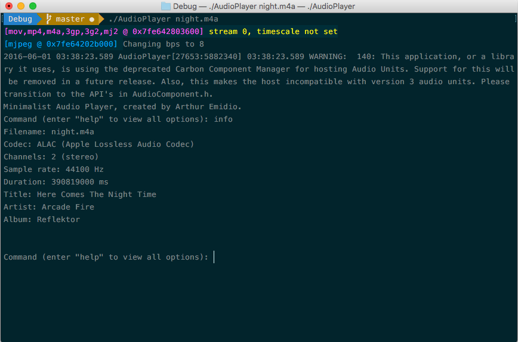
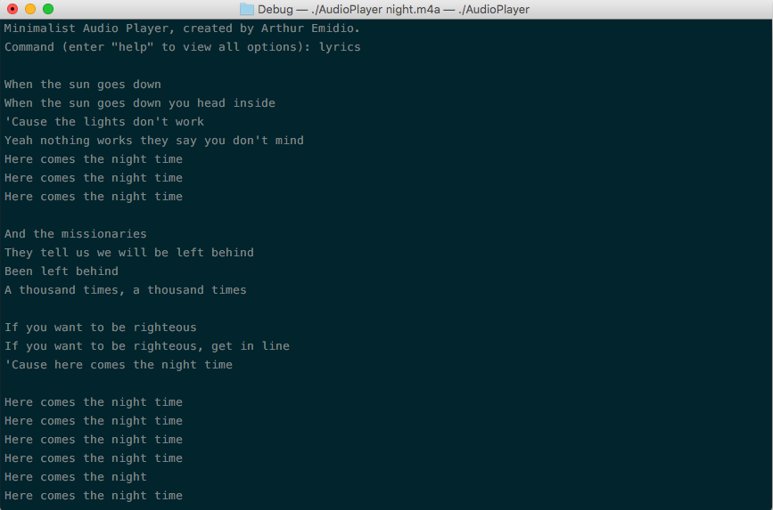

# Minimalist Audio Player
This is a simple command-line audio player developed in C based in the following dependencies:

1. Pthreads
2. FFmpeg 3.02 libraries
3. SDL 1.2.15
4. libcurl 7.48.0

This is a personal project used as a way to learn more about audio decoding and libcurl.

## Features
The player has the following menu options:

1. **play**: plays the song.
2. **pause**: pauses the song.
3. **stop**: stops the song.
4. **info**: displays information about the file.
5. **lyrics**: displays the song's lyrics.
6. **show_buffer N**: displays the buffer occupation every N milliseconds. N is 200, by default.
7. **hide_buffer**: disables the command given by the command "show_buffer".
8. **exit**: exits the player.

### Lyrics Support
The player displays the lyrics present in the audio file's metadata, if existing. Otherwise, it attempts
to download the lyrics available at [azlyrics.com](http://azlyrics.com). The audio player
makes sure to let the user know when lyrics have been obtained from the web.

## Compiling
On OS X, the program can be compiled using the Xcode project.

It can also be compiled via gcc by running:

*gcc -std=c99 main.c audiochunk.c audioplayer.c lyricsdownloader.c 
-lavformat -lavcodec -lavutil -lswscale -lswresample -lpthread 
-lz -lm -lva -llzma -lcurl `sdl-config --cflags --libs`
-Wno-deprecated-declarations -o audioplayer`*

## Running
*./audioplayer filename.ext*

## Screenshots

## License
MIT License

Copyright (c) 2016 Arthur Emídio

Permission is hereby granted, free of charge, to any person obtaining a copy
of this software and associated documentation files (the "Software"), to deal
in the Software without restriction, including without limitation the rights
to use, copy, modify, merge, publish, distribute, sublicense, and/or sell
copies of the Software, and to permit persons to whom the Software is
furnished to do so, subject to the following conditions:

The above copyright notice and this permission notice shall be included in all
copies or substantial portions of the Software.

THE SOFTWARE IS PROVIDED "AS IS", WITHOUT WARRANTY OF ANY KIND, EXPRESS OR
IMPLIED, INCLUDING BUT NOT LIMITED TO THE WARRANTIES OF MERCHANTABILITY,
FITNESS FOR A PARTICULAR PURPOSE AND NONINFRINGEMENT. IN NO EVENT SHALL THE
AUTHORS OR COPYRIGHT HOLDERS BE LIABLE FOR ANY CLAIM, DAMAGES OR OTHER
LIABILITY, WHETHER IN AN ACTION OF CONTRACT, TORT OR OTHERWISE, ARISING FROM,
OUT OF OR IN CONNECTION WITH THE SOFTWARE OR THE USE OR OTHER DEALINGS IN THE
SOFTWARE.
